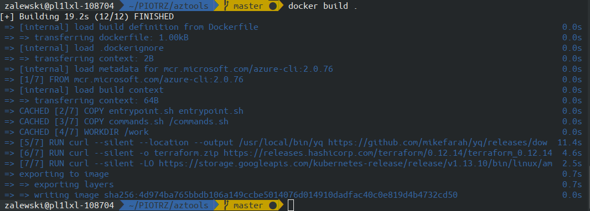

# Docker tips and tricks for developers

What is this presentation about ?


Not about production, not about deploying

We will talk about using developer tools packed in docker images.


# Why use docker on your workstation ?


\ 


# Why use docker on your workstation ?

* Isolation
* Experience with docker


# Using ready images of tools

\


| Tool name | count |
|:---------:|------:|
|mysql      | 18.163|
|postgresql |  4.137|
|java       | 21.419|
|consul     |  2.989|


# Postgresql

```
docker run --name pg9.6 -e POSTGRES_PASSWORD=mysecret 
    -d postgres:9.6
docker run --name pg11 -e POSTGRES_PASSWORD=mysecret 
    -d postgres:11

```
\


# VSCode

```bash
docker run -it -p 8080:8080 
    -v "$(pwd):/home/coder/project" 
    codercom/code-server --auth none 
```
\


# Passing secrets to apps

```
docker run -it --rm 
   -e AWS_SECRET_KEY = XXXSSDSXSXXXX
   -e AWS_ACCESS_KEY = XSwewedfwewee
    pzalews/awscli
    aws rds describe-db-instances --output table

docker run -it --rm -v ~/.aws:/aws/.aws:ro 
    pzalews/awscli
    aws rds describe-db-instances --output table

alias awsd='docker run -it --rm -v "$(pwd):/aws" 
          -v ~/.aws:/aws/.aws:ro -e AWS_PROFILE=had-dev 
          pzalews/awscli aws'
```

\


# Network mode host

```
alias consul='docker run -d --rm 
-e CONSUL_BIND_INTERFACE=enxa44cc8d6bc80 
--net=host 
consul'

```

# Debug network interfaces

```
docker run --name ubuntu -it ubuntu /bin/bash
docker run --net=container:ubuntu 
       -v $(pwd)/temp:/dump  
       corfr/tcpdump -s 65535 -w /dump/test.dump
```


# Kali Linux


``` 
docker run -d -p 6080:6080 lukaszlach/kali-desktop:xfce-top10
```

# Dockerizing your tools

# Dockerfile

\


# CMD and ENTRYPOINT


# ADD vs COPY


# Docker buildkit

export DOCKER_BUILDKIT=1
(starting from Docker 18.09)

- new tty output
- better caching 
- mounting some folders for build time
- adding secret informations for build time

# Docker buildkit

\


# Docker buildkit

\


# Dockerfile - layers

\


# Docker image history

\ 


# Layers cache

\


\


# Docker build context

One of first steps in build process is sending build context to docker daemon.

Default build contect is whole directory with all subfolders.

Tip: The rule of thumb is not adding files to the build context, if you do not need them in your Docker image. The Docker context should be minimal and secret-free.

Use wiesly .dockerignore


# Docker build context
```
docker build -f- out/ < Dockerfile
```

# Scanners - hadolint

Best practices for Dockerfile

```
docker run --rm -i hadolint/hadolint < Dockerfile

```

\


# Cleaninig after work

# logs
add "log-opts": { "max-size": "10m", "max-file":"3"} to daemon.logs

# other logs drivers

you could use "syslog" for redirect all logs to syslog


# docker system prune

```
docker system prune
```


This doesn't clean by default:
* Running containers
* tagged images
* volumes

#restart option

\ 


# docker system prune

```
docker run -d --restart=unless-stopped --name cleanup -v /var/run/docker.sock:/var/run/docker.sock docker /bin/sh -c "while true; do docker system prune -f && date ; sleep 24h; done"

```

# java multistage build

Show time


